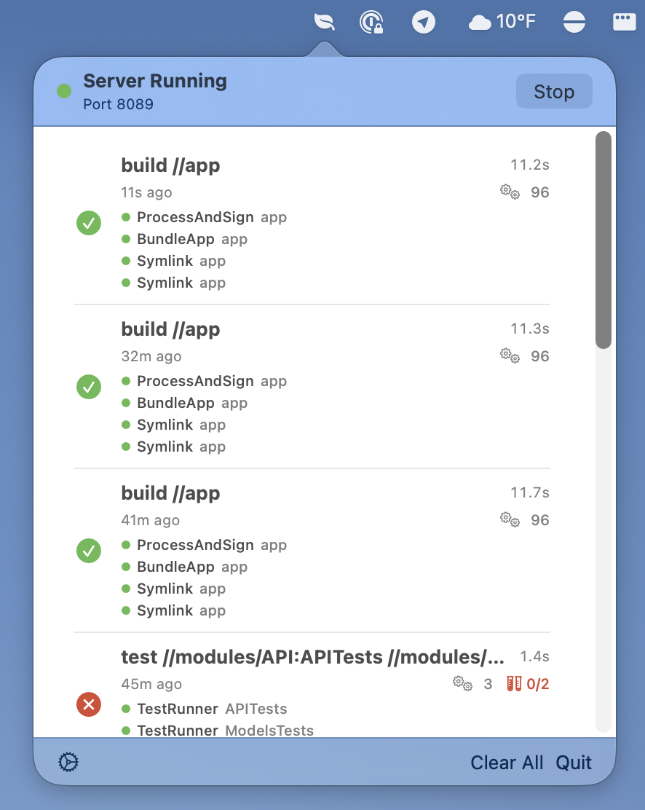

I was curious about [Claude Code](https://claude.com/product/claude-code) after the months (years?) of hype happening around the internet. Over the past week, I've been using it a bit for normal work and then exploring various ideas that have been living in my head rent free for some years.

One of those ideas has been some way to get visibility into Bazel builds running on your machine. There are many services ([BuildBuddy](https://www.buildbuddy.io) and so on) that provide this service remotely but these can be overkill when wanting a small amount of visibility for personal projects.

Claude was easily able to build out a macOS menubar application (without any Xcode project complexity) using a `Package.swift` as the dependency declarations.

<div class="image-row">




</div>

The next difficult task was setting up the reference to the underlying protobuf files that allow the Swift codebase to both (a) provide the [Build Event Service (BES)](https://bazel.build/remote/bep) and (b) decode the [Build Event Protocol (BEP)](https://bazel.build/remote/bep) events. Claude struggled with this because of the complexity of the BEP proto files in the [Bazel codebase](https://github.com/bazelbuild/bazel) but that was easy to remedy by pointing it to use [`swift-bazel-build-event`](https://github.com/luispadron/swift-bazel-build-event) instead of trying to handle the complexity of the proto relationships itself, which it wasn't able to successfully do before being redirected. Before this redirection, Claude was searching around for why the BEP events were experiencing decoding errors without success using logging in the console output from the app.

When the app is opened and the BES server is ready for requests, it provides the simple Bazel config changes to add to the commands or a `.bazelrc` file:

```
build --bes_backend=grpc://localhost:8089
build --build_event_publish_all_actions
```

Running a build will update the list as it progresses and similarly once it's completed.

<div class="image-row">


</div>

This isn't necessarily a pitch that you should use this app or even things like Claude Code but just documenting my exploration into what agentic engineering enables. I've long wanted to have this app and I was able to get this up and running in less than a day of work. Stay tuned as I develop my opinion on agentic engineering and build more stuff.

View the code [on Github](https://github.com/mattrobmattrob/pesto) and critique my (Claude's?) work.
